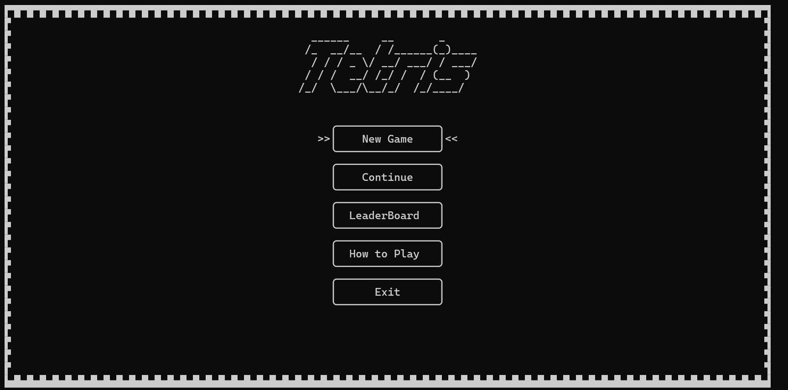
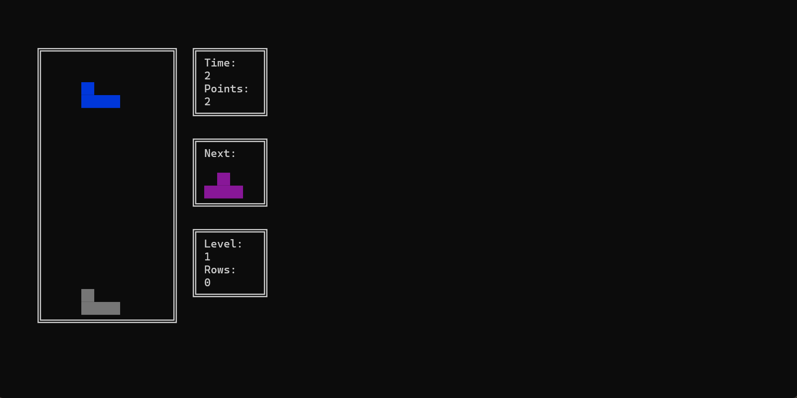
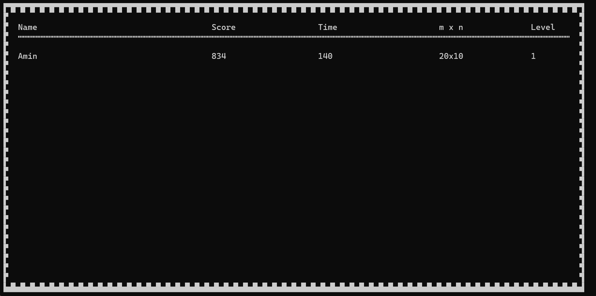
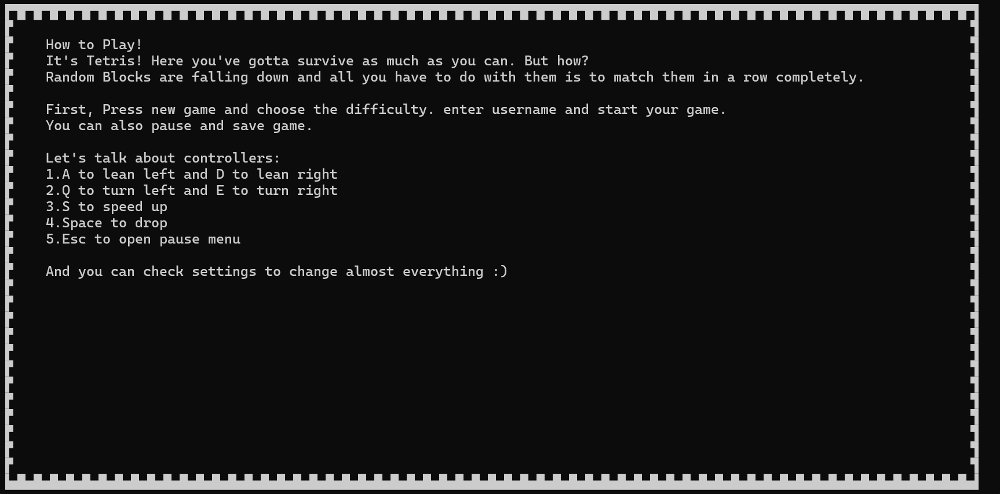
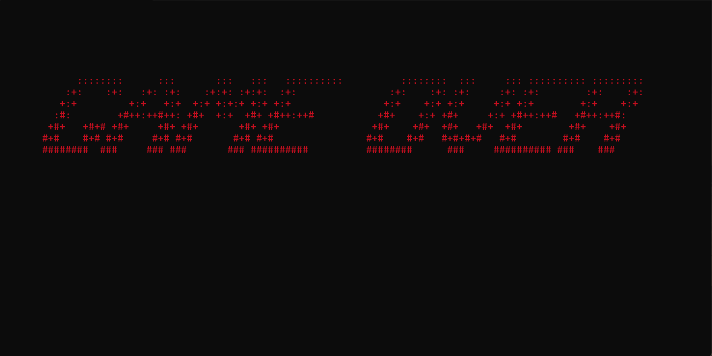

# Tetris

Terminal version of iconic game "Tetris" with C++


## Features

- Dark Mode atmosphere with several ASCII arts
- Save, Restart and Continue for latest game
- Different difficulty levels
- Different sizes for game board
- Soundtracks and colorful graphics to make it more enjoyable
- And almost every feature the orginal Tetris has :)


## Screenshots







## Installation

Install the game by downloading release from this page, and extract the zip file. Then you should just double click on .exe file or:

```cmd
    cd path
    Tetris
```

## Dependencies

- Windows 10 or later
- Micorsoft visual C++

You should enable Unicode UTF-8 to experience game. To do so:

Control Panel -> Region -> Adminstrative -> Change System Locale... -> Use Unicode UTF-8 for worldwide language support

You should check it and now game is ready to play!

    
## Authors

- [@osumy](https://github.com/osumy)
- [@AminGh05](https://github.com/Amin-Gh-05)


## Acknowledgements

- [W3Schools C++ tutorial](https://www.w3schools.com/cpp/)
- [SBU Mathematics and Computer Science Department](https://mathsci.sbu.ac.ir/)
- [Shayan Shahrabi (As Mentor)](https://github.com/ShayanShahrabi)
